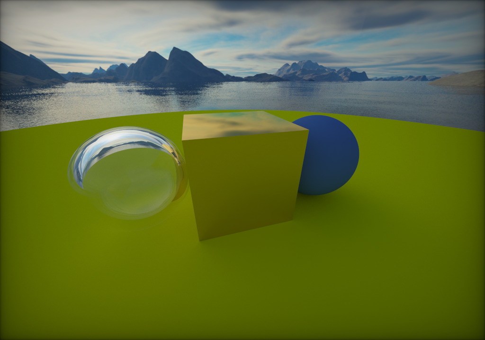

# Ray Tracing Now!

**_WARNING_:** This project is no longer maintained, so it may not work on your platform!

Ray Tracing Now!, also known as rtnow, is a path tracer that runs in real time. It is a flexible ray tracing application that is highly efficient and modular. The scene in the below picture is from [Peter Shirley's astonishing Ray Tracing book series](https://raytracing.github.io/)

 

## Requirements
I chose to use OpenGL 4.5 in this project because the new [Direct State Access (DSA)](https://www.khronos.org/opengl/wiki/Direct_State_Access) feature introduced in OpenGL allows developers to create graphics programs in a more intuitive manner. I also made use of OpenGL's header file mechanism to arrange codes in a more modular and strict fashion, so your device must be compatible with OpenGL 4.5 and its `ARB_shading_language_include` extension in order for this program to run properly.

## Design
The software architecture of this program is based on [this ray tracer](https://github.com/RayTracing/raytracing.github.io) and [pbrt](https://github.com/mmp/pbrt-v3), which divides the system into five parts: ray, scene, material, shape, and utilities. There are three stages in the rendering process: vertex shader, main ray tracing routine, and post-processing.

Because the main part of the rendering method used by this program is in screen space, the vertex shader stage simply draws a triangle that fills the entire screen.

The fragment shader contains headers from the three system components mentioned above. It first initializes the scene, then uses scene helper functions to store various types of objects in various arrays and provides a common interface to create the illusion of polymorphism. After generating an appropriate ray, the ray tracing routine begins backtracing the light information using Turner Whitted's Ray Tracing algorithm. Because recursion is not allowed in shader due to its lack of dynamic-sized stack support, the recursive tracing function was unrolled. External parameters such as camera location and screen size are declared uniform in order to allow the CPU-side main program to input them from the outside.

To avoid aliasing artifacts in the rendering result, the post-processing stage generates "samples" with random offset to the ray direction and traces rays using the ray tracing routine, then computes the average color of them. Later, it adds a slight vignette effect to the viewport; the implementation is available [here](https://www.shadertoy.com/view/lsKSWR). All rendered pixels are accumulated in a buffer; if the camera's position and view angle in the current frame are the same as they were in the previous frame, the previous accumulated pixels are used, giving the user a better experience with less noise.

## Scene
This path tracer's default scene, which is hard-coded in the fragment shader, consists of three spheres, a cube, and a color atmosphere. The environment map for the amazing skybox was obtained from the Internet, and all materials in the scene can be found in the [Ray Tracing in One Weekend](https://raytracing.github.io/) book series I linked to in the references section.

Lambertion reflection, which has a diffuse reflection property and would evenly scatter rays, is used to shade the sphere on the right and the ground sphere. The fuzziness of the metallic cube in the center of the image can be slightly adjusted to change its smoothness or roughness. The glass ball on the left is the most interesting object in the scene; it is actually a hollow object described by two spheres with positive and negative radius; the reflectance and transmission of its material are computed using Schlick's approximation of the Fresnel equation. These materials provide an incredible representation of how objects appear in reality.

## Dependencies
* [GLFW](https://github.com/glfw/glfw) - Multi-platform library for OpenGL, window and input 
* [GLM](https://github.com/g-truc/glm) - OpenGL Mathematics Library
* [GLAD](https://github.com/Dav1dde/glad) - OpenGL Loader
* [stb](https://github.com/nothings/stb) - A set of single-file libraries for C/C++

## References
* [Ray Tracing in One Weekend](https://raytracing.github.io/)
* [Physically Based Rendering](https://pbrt.org/)
