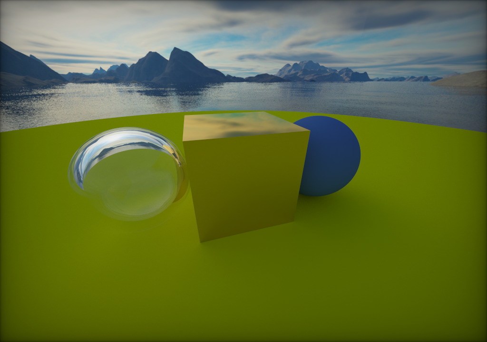

# Opticus

Opticus ([ˈɔpt̪ɪkʊs̠], a Latin word meaning "optic") is an implementation of the ray tracer introduced in Peter Shirley's remarkable [Ray Tracing in One Weekend](https://raytracing.github.io/) series. It incorporates several enhancements and optimizations to render a photorealistic scene featuring two spheres and one cube with exceptional efficiency, generating frames seamlessly in real-time (though some noise may be present, which can be mitigated by staring at a certain position shortly). This performance is made possible through the utilization of OpenGL's highly efficient shader mechanism, enabling the whole rendering process to run on the GPU.

 

## Build Instructions
To build Opticus, the following libraries are required (you can install them using the package manager of your operating system):
* [GLFW](https://github.com/glfw/glfw)
* [GLM](https://github.com/g-truc/glm)

After the dependencies listed above are all installed, run the following instructions to build Opticus:
```sh
git clone https://github.com/alanjian85/opticus.git --recursive && cd opticus
mkdir build && cd build
cmake -DCMAKE_BUILD_TYPE=Release ..
cmake --build .
```

The compiled binary can then be found in the directory `build`. Execute it from the root of Opticus so that it can access the shader source files.

## References
* [Ray Tracing in One Weekend](https://raytracing.github.io/)
* [Physically Based Rendering](https://pbrt.org/)
